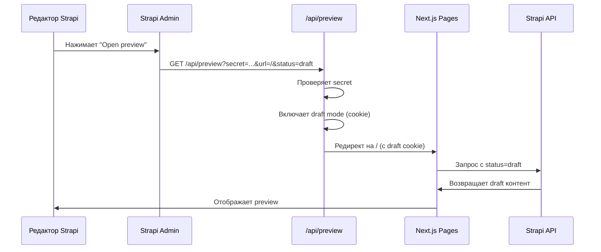

# Strapi Preview Mode

## 📋 Обзор

Strapi Preview Mode позволяет редакторам просматривать черновики контента перед публикацией прямо из админ-панели Strapi. Интеграция с Next.js Pages Router обеспечивает seamless preview опыт через Next.js Draft Mode.

## 🎯 Возможности

- **Preview черновиков** - Просмотр draft контента перед публикацией
- **Интеграция с Next.js** - Использование Next.js Draft Mode для безопасного preview
- **Безопасность** - Защита через секретный ключ (PREVIEW_SECRET)
- **Простота использования** - Одна кнопка "Open preview" в Strapi админке
- **Выход из Preview Mode** - Удобный способ выйти из preview mode через UI баннер

## 🏗️ Архитектура



## ⚙️ Настройка

### 1. Переменные окружения

#### Strapi (`@strapi/.env`)

```env
# URL фронтенд приложения
CLIENT_URL=http://localhost:3000

# Секретный ключ для Preview (должен совпадать с Next.js)
PREVIEW_SECRET=your-preview-secret-key
```

#### Next.js (`.env`)

```env
# Секретный ключ для Preview (должен совпадать со Strapi)
PREVIEW_SECRET=your-preview-secret-key
```

**Важно**: `PREVIEW_SECRET` должен быть одинаковым в обоих файлах!

### 2. Конфигурация Strapi

Конфигурация уже настроена в `@strapi/config/admin.ts`:

```typescript
preview: {
  enabled: true,
  config: {
    allowedOrigins: env('CLIENT_URL'),
    async handler(uid, { documentId, locale, status }) {
      // Генерирует preview URL
      // ...
    },
  },
}
```

### 3. API Routes в Next.js

#### `/api/preview` - Вход в Preview Mode
API route создан в `src/pages/api/preview.ts` и обрабатывает:
- Валидацию секретного ключа
- Включение/выключение Draft Mode
- Редирект на указанную страницу

#### `/api/exit-preview` - Выход из Preview Mode
API route создан в `src/pages/api/exit-preview.ts` и обрабатывает:
- Отключение Draft Mode
- Редирект на текущую страницу или главную

## 📝 Использование

### Для редакторов

1. Откройте контент в Strapi админке (например, Home Page)
2. Нажмите кнопку **"Open preview"** в правом верхнем углу
3. Preview откроется в новой вкладке с draft контентом
4. В верхней части страницы появится баннер **"Preview Mode"** с кнопкой **"Выйти из Preview"**
5. Нажмите кнопку для выхода из preview mode и возврата к опубликованному контенту

### Для разработчиков

#### Добавление поддержки Preview для нового content type

1. Обновите `getPreviewPathname` в `@strapi/config/admin.ts`:

```typescript
const getPreviewPathname = (uid: string, { locale, document }: { locale?: string; document: any }): string | null => {
  if (uid === "api::home-page.home-page") {
    return "/";
  }
  
  // Добавьте новый content type
  if (uid === "api::article.article") {
    return `/articles/${document.slug}`;
  }
  
  return null;
};
```

2. Обновите функцию получения данных для поддержки draft status:

```typescript
// src/_pages/article/api/getArticle.ts
export const getArticle = async (options?: { status?: "draft" | "published" }) => {
  const article = strapiClient.collection("article");
  
  const findOptions: Parameters<typeof article.find>[0] = {
    // ... populate options
  };
  
  if (options?.status) {
    findOptions.status = options.status;
  }
  
  const json = await article.find(findOptions);
  return json.data;
};
```

3. Обновите `getServerSideProps` для проверки draft mode:

```typescript
// src/pages/articles/[slug].tsx
export async function getServerSideProps(context: GetServerSidePropsContext) {
  const isDraftMode = context.draftMode || false;
  
  const data = await getServerSidePropsData(
    {
      article: () => getArticle({ status: isDraftMode ? "draft" : "published" }),
    },
    { isDraftMode },
  );
  
  // ...
}
```

## 🔧 Технические детали

### Strapi Preview Handler

Handler в `@strapi/config/admin.ts` генерирует URL вида:

```
${CLIENT_URL}/api/preview?secret=${PREVIEW_SECRET}&url=/&status=draft
```

### Next.js Draft Mode

В Pages Router используется `res.setDraftMode({ enable: true })`, который устанавливает cookie `__prerender_bypass` для включения draft mode.

### Preview Banner Component

Компонент `PreviewBanner` автоматически отображается на всех страницах, когда активен preview mode:
- Проверяет наличие cookie `__prerender_bypass`
- Показывает индикатор "Preview Mode" в верхней части страницы
- Предоставляет кнопку для выхода из preview mode
- Компонент находится в `src/shared/ui/preview-banner/` и автоматически подключен в `_app.tsx`

### Проверка Draft Mode в getServerSideProps

```typescript
export async function getServerSideProps(context: GetServerSidePropsContext) {
  const isDraftMode = context.draftMode || false;
  // ...
}
```

### Передача Draft Status в Strapi запросы

Функции получения данных должны принимать опции с `status`:

```typescript
export const getContent = async (options?: { status?: "draft" | "published" }) => {
  const content = strapiClient.single("content-type");
  
  const findOptions: Parameters<typeof content.find>[0] = {
    // ... options
  };
  
  if (options?.status) {
    findOptions.status = options.status;
  }
  
  return await content.find(findOptions);
};
```

## 🔒 Безопасность

### Защита Preview API

1. **Секретный ключ** - `PREVIEW_SECRET` проверяется перед включением draft mode
2. **Валидация URL** - Проверка origin для предотвращения open redirect
3. **Только серверные переменные** - `PREVIEW_SECRET` доступен только на сервере

### Рекомендации

- Используйте сильные случайные ключи для `PREVIEW_SECRET`
- Генерируйте ключ через `openssl rand -hex 32`
- Не коммитьте `PREVIEW_SECRET` в Git
- Используйте разные ключи для development и production

## 🐛 Решение проблем

### Preview не открывается

**Проблема**: Кнопка "Open preview" не работает или показывает ошибку

**Решение**:
1. Проверьте, что `CLIENT_URL` и `PREVIEW_SECRET` настроены в `@strapi/.env`
2. Убедитесь, что `PREVIEW_SECRET` совпадает в Strapi и Next.js
3. Проверьте, что Next.js сервер запущен и доступен по `CLIENT_URL`
4. Проверьте логи Strapi: `docker logs ${PROJECT_SLUG}_backend`

### Draft контент не отображается

**Проблема**: Preview показывает опубликованный контент вместо draft

**Решение**:
1. Проверьте, что `getServerSideProps` проверяет `context.draftMode`
2. Убедитесь, что функция получения данных передает `status: "draft"`
3. Проверьте, что content type имеет `draftAndPublish: true` в схеме
4. Убедитесь, что контент сохранен как draft в Strapi

### Ошибка "Invalid token"

**Проблема**: API route возвращает 401 "Invalid token"

**Решение**:
1. Проверьте, что `PREVIEW_SECRET` одинаковый в Strapi и Next.js
2. Убедитесь, что нет пробелов или переносов строк в ключе
3. Перезапустите оба сервера после изменения `PREVIEW_SECRET`

### Preview открывается, но показывает ошибку

**Проблема**: Preview открывается, но страница показывает ошибку

**Решение**:
1. Проверьте, что функция получения данных поддерживает `status` параметр
2. Убедитесь, что `getServerSidePropsData` передает `isDraftMode`
3. Проверьте логи Next.js сервера
4. Убедитесь, что Strapi API доступен и возвращает draft контент

## 📚 Дополнительные ресурсы

- [Strapi Preview Documentation](https://docs.strapi.io/cms/features/preview)
- [Next.js Draft Mode](https://nextjs.org/docs/pages/building-your-application/configuring/draft-mode)
- [Strapi Documents API](https://docs.strapi.io/dev-docs/api/rest/documents-api)

## 🔄 Обновление конфигурации

### Добавление нового content type

1. Откройте `@strapi/config/admin.ts`
2. Обновите функцию `getPreviewPathname`:

```typescript
const getPreviewPathname = (uid: string, { locale, document }: { locale?: string; document: any }): string | null => {
  switch (uid) {
    case "api::home-page.home-page":
      return "/";
    case "api::article.article":
      return document.slug ? `/articles/${document.slug}` : "/articles";
    case "api::page.page":
      return document.slug ? `/${document.slug}` : null;
    default:
      return null;
  }
};
```

3. Обновите функцию получения данных для нового типа
4. Обновите соответствующий `getServerSideProps`

### Выход из Preview Mode

Для выхода из preview mode доступны два способа:

1. **Через UI баннер** (рекомендуется):
   - Когда активен preview mode, в верхней части страницы отображается баннер "Preview Mode"
   - Нажмите кнопку **"Выйти из Preview"** для выхода
   - Страница автоматически перезагрузится с опубликованным контентом

2. **Через API route напрямую**:
   - Перейдите по адресу `/api/exit-preview`
   - Или с редиректом на конкретную страницу: `/api/exit-preview?redirect=/your-page`

## ✅ Чеклист настройки

- [ ] `CLIENT_URL` настроен в `@strapi/.env`
- [ ] `PREVIEW_SECRET` настроен в `@strapi/.env` и `.env` (одинаковый)
- [ ] Preview включен в `@strapi/config/admin.ts`
- [ ] API route `/api/preview` создан и работает
- [ ] API route `/api/exit-preview` создан и работает
- [ ] Компонент `PreviewBanner` подключен в `_app.tsx`
- [ ] Функции получения данных поддерживают `status` параметр
- [ ] `getServerSideProps` проверяет `context.draftMode`
- [ ] Content types имеют `draftAndPublish: true` в схемах
- [ ] Тестирование preview для всех поддерживаемых content types
- [ ] Тестирование выхода из preview mode через UI баннер