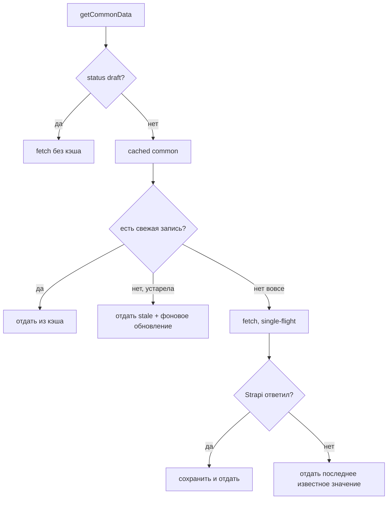

# Серверное кэширование данных Strapi

Как устроено кэширование ответов Strapi на стороне Next.js-сервера: что кэшируется, на чём
(`lru-cache`), как ведёт себя при промахе/устаревании/падении CMS и как это расширять.

- Код кэша: [`src/shared/api/cache/cache.ts`](../src/shared/api/cache/cache.ts)
- Теги и карта «модель → теги»: [`src/shared/api/cache/tags.ts`](../src/shared/api/cache/tags.ts)
- Потребитель: [`src/shared/api/strapi/getCommonData.ts`](../src/shared/api/strapi/getCommonData.ts)
- Стратегия (что и насколько кэшировать, ISR) — скилл `caching-and-isr`; флоу серверных запросов —
  скилл `server-data-fetching`. Эталоны кода: [`docs/examples/cached-fetcher/`](./examples/cached-fetcher/docs.md).

## Зачем это нужно

Проект на **Pages Router**: `getServerSideProps` выполняется **на каждый запрос** и **не имеет
встроенного кэша**. Глобальные данные (single-type `common`: SEO по умолчанию, соцсети, контакты)
нужны на каждой странице, но меняются редко. Без кэша Strapi получал бы одинаковый запрос на
каждую навигацию.

> Почему не `unstable_cache` / `fetch`-кэш Next.js: они рассчитаны на App Router и его incremental
> cache. В Pages Router либо не работают, либо ведут себя непредсказуемо. Нужен обычный серверный
> кэш в памяти процесса — им и является `lru-cache`.

## Что и где кэшируется

Кэшируется результат `getCommonData()` под ключом `"common"`. Страничные запросы (`getHomePage`
и т.п.) **не** кэшируются на этом слое — они уникальны для страницы; кэшируются именно повторяемые
глобальные данные.

```
getServerSideProps (каждый запрос)
  → getServerSidePropsData(...)
      ├─ getCommonData()   → cached("common", loader)   ← сюда бьёт кэш
      └─ getHomePage()     → без кэша (данные страницы)
```

## Как работает `cached()`

`cache.ts` создаёт единственный экземпляр `LRUCache` и экспортирует хелпер:

```ts
cached("common", () => fetchCommonData("published"));
```

Ключевые опции lru-cache и что они дают:

| Опция | Поведение |
|---|---|
| `ttl` (по умолчанию 60с) | срок жизни записи; можно переопределить пер-ключ (`cached(key, loader, { ttlMs })`) |
| `allowStale: true` | **stale-while-revalidate**: после истечения TTL пользователь получает прошлое значение мгновенно, обновление идёт в фоне — SSR не ждёт Strapi |
| `fetchMethod` + `.fetch()` | **single-flight**: параллельные запросы одного ключа делят ОДИН промис — всплеск трафика/холодный старт не бьёт по Strapi пачкой одинаковых запросов |
| `noDeleteOnFetchRejection: true` | при ошибке загрузки отдаём последнее известное значение, а не роняем страницу в 500 |
| `max: 200` | LRU-вытеснение по числу ключей — кэш не растёт бесконечно |

Значения хранятся в «боксе» `{ value }`, потому что lru-cache требует non-nullable значение, а
запрос легально возвращает `null` (пустой single-type).

Экземпляр кэша **и карта тегов** держатся в `globalThis`. Не только из-за HMR: страницы и API-роуты
Next компилирует в **разные бандлы**, поэтому модульные переменные у них свои. Если карту тегов
оставить обычной переменной модуля, у эндпоинта сброса она окажется пустой — вебхук отработает с
`removed: 0` и ничего не сбросит, притом что кэш полон. Ошибка тихая: 200 OK и никакого эффекта.

Есть аварийный выключатель: `STRAPI_CACHE_DISABLED=true` полностью обходит кэш (удобно при отладке
контента).

## Жизненный цикл запроса



1. **Первый запрос (промах)** — данных в кэше нет → `fetch` идёт в Strapi, результат кладётся под ключ.
2. **Повторный запрос (попадание)** — в пределах TTL данные отдаются из памяти, без обращения к Strapi.
3. **Устаревание (SWR)** — TTL истёк → пользователь мгновенно получает **прошлое** значение, а в фоне
   запускается обновление; следующий запрос уже получит свежие данные.
4. **Падение Strapi** — при ошибке `fetch` отдаётся последнее известное значение (не 500).
5. **Превью (draft)** — при `status: "draft"` кэш **обходится**: редактор обязан видеть правки сразу.

## Как закэшировать свой фетчер

**Способ 1 — `cachedFetcher()`**, когда результат зависит только от `status`. Подключение сводится
к переименованию функции, вызывающий код не меняется:

```ts
import { CACHE_TAGS, cachedFetcher } from "@shared/api/cache";

const getMenuUncached = async (opts?: { status?: "draft" | "published" }) => { ... };

export const getMenu = cachedFetcher("menu", getMenuUncached, {
  tags: [CACHE_TAGS.pageContent],
});
// draft обходит кэш автоматически, status входит в ключ
```

**Способ 2 — `cached()` вручную**, когда параметров больше одного:

```ts
import { CACHE_TAGS, cached } from "@shared/api/cache";

// ⚠️ ВСЕ параметры обязаны попасть в ключ, иначе разные варианты отдадут контент друг друга
return cached(`products:${filters}:${page}`, load, {
  tags: [CACHE_TAGS.pageContent],
  ttlMs: 15_000,
});
```

Правила:
- **каждый источник — свой ключ** (правка меню не должна сбрасывать шапку);
- **всегда указывай `tags`** — запись без тега невидима для `invalidateTags()` и проживёт весь TTL;
- **не кэшируй недетерминированные фетчеры** (случайный порядок, текущая дата) — значение застынет;
- **превью (`status: "draft"`) не кэшируется** никогда.

## Инвалидация по тегам

`cache/` экспортирует `invalidateTags([...])`, `invalidate(key)`, `invalidateAll()`.

Основной механизм — **теги**, а не ключи: связь «модель Strapi → кэш» many-to-many (один справочник
раскрывается в нескольких источниках, одна коллекция влияет на несколько подсистем). Теги
(`CACHE_TAGS`) и карта `MODEL_TAGS` живут в [`cache/tags.ts`](../src/shared/api/cache/tags.ts);
**неизвестная модель сбрасывает всё** — пропустить инвалидацию дороже, чем лишний раз перезапросить.

Вебхук [`src/pages/api/revalidate.ts`](../src/pages/api/revalidate.ts) (POST + `REVALIDATE_SECRET`,
Strapi → Settings → Webhooks) принимает:

| Тело запроса | Действие |
|---|---|
| `{ event, model \| uid }` (штатный вебхук) | теги по карте модели; тег `sitemap` только на событиях, меняющих набор URL |
| `{ "tags": ["common"] }` | ручной сброс конкретных тегов (приоритетнее карты) |
| `{}` | полный сброс (`invalidateAll()`) |

```bash
curl -X POST https://<домен>/api/revalidate \
  -H "Authorization: Bearer $REVALIDATE_SECRET" \
  -H "Content-Type: application/json" \
  -d '{"event":"entry.update","model":"common"}'
# → {"revalidated":true,"tags":["common"],"removed":1}
```

## Ограничения

- **In-memory, per-instance.** Кэш живёт в памяти процесса Next-сервера. При нескольких репликах
  фронта у каждой свой кэш; для одного контейнера этого достаточно. При масштабировании — подменить
  хранилище на общий бэкенд (Redis) за тем же `cached()`.
- **Сбрасывается при рестарте контейнера** — первый запрос после `docker compose up -d` прогреет заново.
- **Превью не кэшируется** — это намеренно (свежие черновики для редактора).

## Ссылки

- [lru-cache](https://www.npmjs.com/package/lru-cache)
- Оптимизация запросов (fields/populate), которая идёт рука об руку с кэшем — скилл `server-data-fetching`
  и пример `docs/examples/optimized-fetcher/`.
